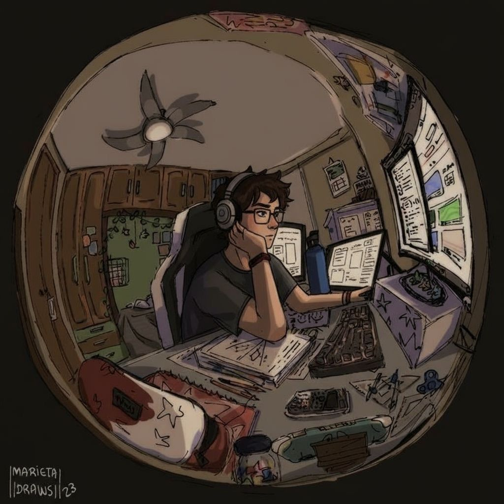
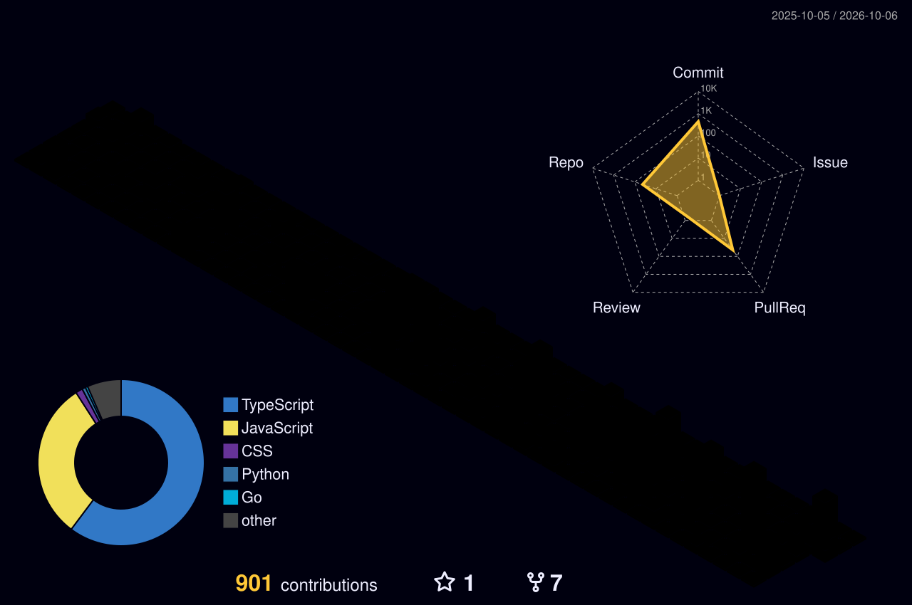

  

  

  
  
  

### 🐍 `CONTRIBUTIONS ARE ALIVE`

<picture>
  <source media="(prefers-color-scheme: dark)" srcset="https://raw.githubusercontent.com/rahuldev403/rahuldev403/output/github-snake-dark.svg">
  
</picture>

  

 

## 🧊 `THE STACK`

<table align="center" border="0">
  <tr>
    <td align="center" width="40%">
  
</td>
    <td align="center" width="62%">
      <b>🧠 Languages</b> 
        
      <b>⚙️ Frameworks</b> 
        
      <b>🗄️ Data & DevOps</b> 
        
      <b>🛠️ Tools</b> 
      
    </td>
  </tr>
</table>

 

## 🧬 `3D CONTRIBUTION UNIVERSE`

  

 

## 🛰️ `THE PHILOSOPHY`

 

### `⚡ BUILD SOMETHING WORTH REMEMBERING ⚡`

  

  <i>"Don't wish it were easier. Wish you were better."</i>

  
 
  

